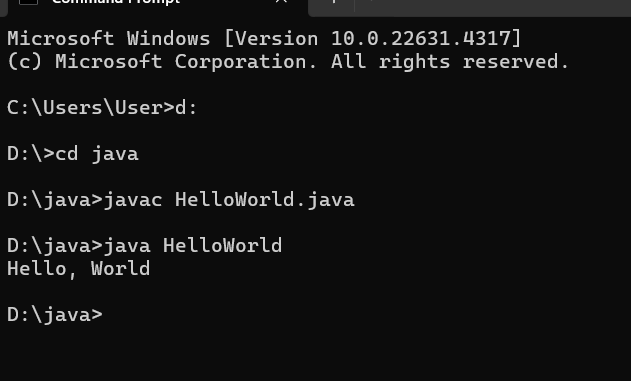
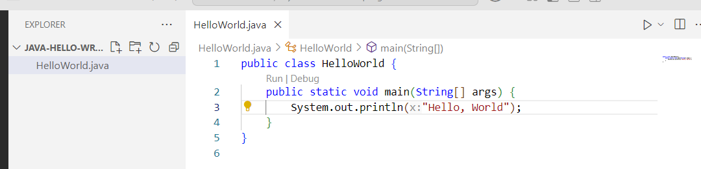
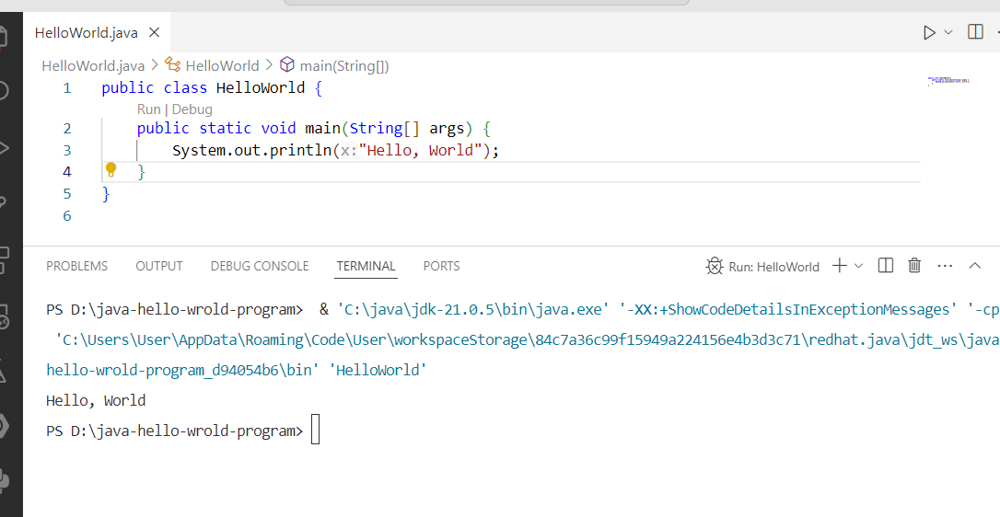

# Java Hello, World Program

As you are in this page, means you are just starting Java or want to know how to write your very first java program. Usually, every programmers go under this simple and effective steps, write Hello, World program in their system. 

Writing Hello, World in java is little bit different and complex than other programming languages, but it's not true for lates Java versions (in case java-23).

Hence, we will know in this post, how to write Java Hello, World program using a text editor and IDE (Integrated Development Environment), such as VS Code.

1. Using a Text Editor

So, let's open a text editor (like: Notepad) and write the following Java code.

```
public class HelloWorld {
    public static void main(String[] args) {
        System.out.println("Hello, World");
    }
}
```

And save it, **HelloWorld.java** extension. All java file basically use .java extension. And we have to remember that, java is a class based language, thus we have to create a class to start the above Hello, World example.

In order to run Java using a simple text editor, we have to know two things. First of all, we have to compile the Java file, then run the compiled file.

Guess, we save the above **HelloWorld.java** file in **D:/java/HelloWorld.java** path.

So, open your system terminal (Command prompt) and redirect to HellWorld.java path and run the following command to compile first, then run or execute.

```
$ javac HelloWorld.java //it will compile your java code into byte code, and generate HelloWorld.java
$ java HelloWorld //it will now execute java class
```



Let's modify the **HelloWorld.java** file. 

```
public class HelloWorld {
    public static void main(String[] args) {
        System.out.println("Hello, World");
        System.out.println("Hurray, I successfully ran the Java Hello, World program");
    }
}
```

Again run the same command. Compile the java file, then run it.

```
$ javac HelloWorld.java
$ java HelloWorld
```


2. Java Hello World Program (Using an IDE)

In this step, we will use, an IDE and run our Java Hello, World program using it. You can use any java based IDE, numerous available including popular one like: IntelliJ IDE, Eclipse or Visual Studio Code (VS Code). Here, I am going to use VS code. For this, we have to download VS code and the **Language Support for Java(TM) by Red Hat** extension from VS code marketplace.

**Download VS Code:** [Download VS Code](https://code.visualstudio.com/). Click here and download the latest VS code for your operating system. You can surely skip this step if you already have VS Code installed in your system.

After Downloading VS code, create a folder in you C or D drive. Let's say, we create a simple project folder in D drive and name it **java-hello-world-program**. Then open it, into your VS code. 

As, VS code by default is not a Java IDE. Thus, we have to download an extension pack called: **Language Support for Java(TM) by Red Hat**. It will help us to write, compile, and run java code from VS code IDE.

So, click on Extension icon (left side by default) or type: **Ctrl+Shift+X**. And then, search Java Extension pack. And scroll and click **Language Support for Java(TM) by Red Hat extension** and install it.

If the extension installed, you can now write Java and execute it directly from VS code.

As you have already opened java-hello-world-program in your vs code, thus now we are going to create a simple **HelloWorld.java** file.

So, create **HelloWorld.java** file and write the following code.

```
public class HelloWorld {
    public static void main(String[] args) {
        System.out.println("Hello, World");
    }
}
```




You can see, a run icon right side of the screen. Click on it, and it will compile and run your java code as usual.

You will then get the following result in the console.

```
Hello, World
```



How lightweight is this! You just write your java code, and click on the run button and it will print the output. 

So, today we learned how to run simple Java program using text editor and IDE. Though, as usual developers use IDE to write Java or any type of code as the IDE provides language specific features.

