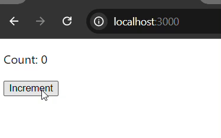
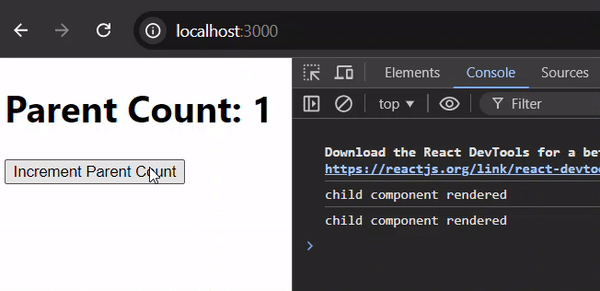
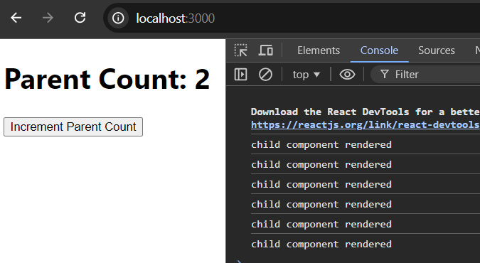

# React UseCallback Hook

The **useCallback** hook in React is used to memorize a function, ensuring that the function is not recreated on every render unless its dependencies change. This can be particularly useful when passing functions to child components, as it helps prevent unnecessary re-renders.

**Syntax**

```
const callBackFunction = useCallback(
  () => {
    // Your callback logic here
  },
  [dependencies],
);
```

**Note:** **UseCallback** and **useMemo** are almost similar by theie nature. The only difference between them is to useCallback return memorized function. On the other hand useMemo returns memorized value. Both prevents rerendering the components unnecessarily.

## Example of UseCallback Hook

Let's look at the following example where we have used **useCallback** hook to return a function that prevents recreation itself.

```
import React, { useState, useCallback } from 'react';

function Counter() {
  const [count, setCount] = useState(0);

  const increment = useCallback(() => {
    setCount((count) => count + 1);
  }, []); // increment will not be recreated on each render as dependency array is empty

  return (
    <div>
      <p>Count: {count}</p>
      <button onClick={increment}>Increment</button>
    </div>
  );
}
```



Here, increment function, we have used **useCallback** hook so that it doesn't recreate for every render (every 1 second automatically without clicking increment button) and returns memorized (previous) function.

Note that, you can use **useCallback** hook when you have a function that you want to avoid recreating unless its dependencies change, particularly when passing functions down to memoized child components. But overuse it without proper consideration it can impose unnecessary complexity that hinders the performance of your application.

## Passing Function as A Prop in Child Components

In React, it is a common practice to pass functions as props in child components. That allow parent components to control the behaviour of their children. 

But, when passing functions as props, it is often useful to optimize performance to prevent unnecessary re-renders. In this regard, **useCallback** hook can help by memoizing the function so that it is not recreated on every render.

Let's see an example of passing a function as prop to child component.

parent.js (Parent component)

```
import React, { useState, useCallback } from 'react';
import Child from './child';


//parent component
const Parent=()=>{
  const [count, setCount] = useState(0);

  // Using useCallback to memoize the function
  const handleIncrement = useCallback(() => {
    setCount((count) => count + 1);
  }, []); //empty dependency means it renders only once

  return (
    <div>
      <h1>Parent Count: {count}</h1>
      {/* Passing the memoized function as a prop to the child component */}
      <Child onIncrement={handleIncrement} />
    </div>
  );
}

export default Parent;
```

child.js (Child Component)

```
import React from 'react';


//child component
const Child=({onIncrement})=>{
    console.log("child component rendered")
  return (
    <div>
      <button onClick={onIncrement}>Increment Parent Count</button>
    </div>
  );
}

export default Child;
```



Here, in the gif file, you can see, how parent count renders only once for each click using the memorized function. It prevents rerenders. 

But if you see, console.log() rendered twice for each button click, make sure you remove the react strictMode feature that intensional for development purposes.



So, open **index.js** file and remove the {`<React.StrictMode />`}. Now, our function will work as expected.

Note: Disabling, strictMode is not recommended because it enables many react features in development, and it will not affect in your production application. So, disabling strictMode can only be okay testing only.

```
//force strictMode
ReactDOM.render(
  // <React.StrictMode>
    <Parent />,
  // </React.StrictMode>,
  document.getElementById('root')
);
//disable it
ReactDOM.render(
    <Parent />,
  document.getElementById('root')
);
```


