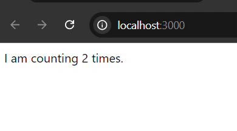

# React UseEffect Hook

UseEffect hook in React is used to handle side effects in functional components. The possible side effects can be data fetching (making api calls from server), subscriptions, timers, manipulating DOM, logging etc. It runs after every render and updates and it allows you to manage side effects in a clean and declarative way.

**Syntax of useEffect Hook**

```
// Similar to componentDidMount and componentDidUpdate:
  useEffect(() => {
    // This code runs after every render
    console.log('Component rendered or count changed!');

    // Cleanup function to run when the component is unmounted or dependencies change
    return () => {
      console.log('Cleanup on unmount or before the next effect!');
    };
  }, []); // Dependency array
```

Here, useEffect is a function that will run after the component renders. It can also return a cleanup function.

The second argument is an optional array of dependencies. The effect will only re-run if any value in this array changes between renders

And, in the optional dependency array, if we set it empty then the effect will only run once after the initial render. But if we omit the dependency array, the effect runs after every render.

## Common Uses of useEffect Hook

**Handling Timer**

Here, we will see a simple example of useEffect hook to handle a timer.

```
import React, { useEffect, useState } from "react"

const Timer=()=>{
    const [seconds, setSeconds] = useState(0);

    useEffect(()=> {
        //start the timer
        setTimeout(() => {
            setSeconds((second) => second + 1); // it increments by 1
        }, 1000); //run every 100 milliseconds (1 second)
    }); //we avoid to use optional dependency array; means, it runs on every render (nonstop)

    return(
        <div>
            I am counting {seconds} times.
        </div>
    )
}

export default Timer;
```

The following image shows that our timer component runs on every render (nonstop). 



What if we want to run the effect (increment by 1) only the first render? In this case, we have to use dependency array. The [] dependency array ensures the effect runs only once when the component mounts. Means, it runs only the first or initial render.

Such as, (the updated one)

```
const [seconds, setSeconds] = useState(0);

useEffect(()=> {
      //start the timer
      setTimeout(() => {
          setSeconds((second) => second + 1); // it increments by 1
      }, 1000); //run every 100 milliseconds (1 second)
  }, []); //using empty dependency array that means the effect only runs on the first render.
```

Here, the timer runs only once.

**Note:** If it doesn't work as expected, please open **index.js** file and remove react strictMode feature {`<React.StrictMode>`}.


