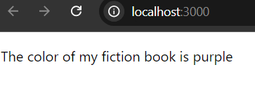
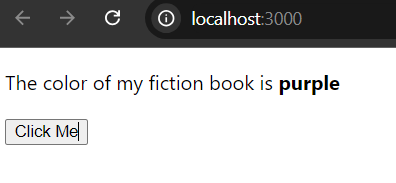
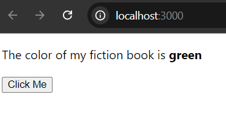
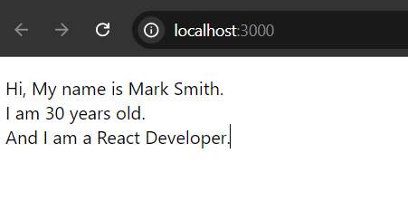
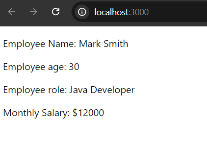
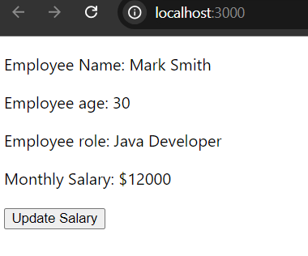
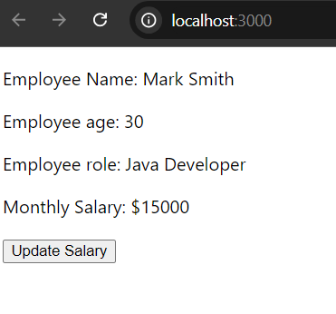

# React useState Hook

Hooks are a new addition in React 16.8 version. They help developers to use state and other React lifecycle features in a functional way without writing class components. 

In this post, I am going to describe about React **useState()** hook with examples. In React, we use useState() hook (that is considered as built in function) in order to manage states or variables in functional components. the useState() hook always returns an array of two elements (the syntax of writing hook). The current state variable and a function to update it (mandatory). Let's see how to write useState hook in a React functional component. 


**Syntax of React useState() Hook**

```
const YourComponent=()=>{
  //declare an state using useState hook
  const [state, setState] = useState(initialValue);

  return(
    <>
    {/*component content*/}
    </>
  )
}
//or
function YourFunction(){
   //declare an state using useState hook
  const [state, setState] = useState(initialStateValue);

  return(
    <>
    {/*component content*/}
    </>
  ) 
}
```

Note: Before, using useState hook in your react functional component, you must import it.

```
import React, { useState } from 'react'; 
//or
const [state, setState] = React.useState();
```


Here, inside the square [] brackets,
- state: It's the current component state/variable.
- useState: a function to update the state value and
- initialStateValue: it't the value of state variable value. The type of state value can be a number, string, object, array, etc.


## Simple Example of React useState Hook

In this example, we will see how to use react useState hook to declare a state variable, use it and later update it. Guess we have a component called **Book** and the state of the Book could be **color**. Note that, in order to access the value of current state, we use curly brackets {`{}`}

```
import React, { useState } from 'react';

//root function
function App() {
  return(
    <div>
      <Book />
    </div>
  )
}

//Book functional Component
const Book=()=>{
  //declare variable using useState hook
  const [color, setColor] = useState("purple");

  return(
    <div>
      <p>The color of my fiction book is {color}</p>
    </div>
  )
}

export default App;
```

Now, if you run the app, using ***npm run start*** command, you can see the color state variable value has been rendered in your browser.



## Update State Value

You may notice that, in the book component, there is a method called setColor in useState hook, that is responsible for changing the initial state value. So, change the initial state value using setColor method. Here, we use a button to change the state value.

```
//Book functional Component
const Book=()=>{
  //declare variable using useState hook
  const [color, setColor] = useState("purple");

  return(
    <div>
      <p>The color of my fiction book is <b>{color}</b></p>

      {/*The color value will be updated when the button is clicked*/}
      <p>
        <button onClick={()=> setColor("green")}>Click Me</button>
      </p>
    </div>
  )
}
```

Here, when you now open [http://localhost:3000/](http://localhost:3000/) you will see the following page:



But, after clicking the Click Me button, the state value changed to green.



## Multiple State Hooks

We can declare more than one state variables using useState hook in functional component. Such as,


```
const MyDetails=()=>{
  //declare three state variable
  const [name, setName]= useState("Mark Smith");
  const [age, setAge] = useState(30);
  const [role, setRole] = useState("React Developer");

  return(
    <div>
      {/*access the value of state variable*/}
      <p>
        Hi, My name is {name}. <br/>
        I am {age} years old. <br/>
        And I am a {role}.
      </p>
    </div>
  )
}
```

Response would be in [http://localhost:3000/](http://localhost:3000/)



## React useState Hook that Holds Object

Instead of creating new state variable for holding each state value, react state can hold object of values for a single state (either they are initialized or empty). Here’s a simple example of a component that uses useState to manage an object and displays its properties.

```
```

## React useState Hook that Holds an Array

If our useState hook holds array of data (using a single variable) then, the syntax will be ***useState([])***. Let's see the following example.

```

```

If you start your development server, then you will see the following window.


**Note:** Here, we have used the javascript **map()** method to iterate array elements of our planets state. But, you can use forEach loop as well. What is you want to access single element? Then, you use the index number of particular element.

```
planets[0] : will return the first element
planets[1] : will return the second element
planets[planets.length - 1] : will return the last element and so on.
```

## Update Object or Array Properties 

Similarly array, we can also store objects in useState hook. But, we have to know that, objects are written by (key, value) pairs. And in order to access them, we have to invoke the keys.

Objects are written in useState hook:

```
useState({
  ...
})
```

Let's see an example useState hook, that holds objects.

```
const EmployeeDetails=()=>{
  const [employee, setEmployee] = useState({
    name: 'Mark Smith',
    age: 30,
    role: 'Java Developer',
    salary: 12000
})
  return(
    <div>
      <p>Employee Name: {employee.name}</p>
      <p>Employee age: {employee.age}</p>
      <p>Employee role: {employee.role}</p>
      <p>Monthly Salary: ${employee.salary}</p>
    </div>
  )
}
```

You can see that, we have used the key name in order to access the value of employee object.

So, the output would be the following if you run your application:



## Update Object Properties or Array Elements

In order to update a single state variable is very simple. If your initial state name is color, then calling the setColor method will update the value of the color variable. But, in case array or object properties, when you call the updating method like setState then then entire array or object (all the properties get updated - it creates performance issues). So, the following approach will be taken while updating a single element of an array or property of an object. 

```
const EmployeeDetails=()=>{
  const [employee, setEmployee] = useState({
    name: 'Mark Smith',
    age: 30,
    role: 'Java Developer',
    salary: 12000
})

//function to update employee salary
const updateSalary=()=>{
  setEmployee((previousEmployee)=> ({
    ...previousEmployee, // Copy all previous properties
    salary: 15000  //update salary property
  }))
}

  return(
    <div>
      <p>Employee Name: {employee.name}</p>
      <p>Employee age: {employee.age}</p>
      <p>Employee role: {employee.role}</p>
      <p>Monthly Salary: ${employee.salary}</p>

      {/*Button to update employee salary*/}
      <p>
        <button 
        type='button'
        onClick={updateSalary}
        >Update Salary</button> {/*also: onClick={()=> updateSalary}*/}
      </p>
    </div>
  )
}
```

So, before clicking the update Button:



After clicking the update salary button:




**Benefits of this approach:**

Instead of update all the elements or properties (using the spread operator), it only updates or modify the requested property or properties. This approach avoids overwriting the entire object, ensuring that unchanged properties remain intact and prevent the accidental loss of state properties that are not directly involved in the update.

So, in this post, we go thorough all the approaches how to use useState hook in our react application at the same time we also discussed how to update state using the setState built in function.

**Key things to note about useState hook in React**

- useState hook is used to set state or variable in React functional component.
- It can't be used in class components in React.
- It returns an state variable and method a method to update it.
- The proper syntax of useState hook: const [state, setState] = useState(initialState)
- State updates made with setState are asynchronous, meaning that the state is not immediately updated. Instead, it is scheduled to update and causes a re-render.
- The initial value can be a direct value or a function. As well as, they can be initialized or empty.
- When updating state with useState, the new state value completely replaces the previous state. 
- If you want to update specific properties in an object or array, you need to spread the previous state:
- Every time you call setState, the component re-renders. Therefore, avoid unnecessary state updates to prevent performance issues
- useState Hook Cannot Be Called Conditionally.
- We can use multiple useState() hooks, in one component (discussed above)
- It can be used inside a custom hook.
- When the new state depends on the previous state, it is recommended to use a functional update to avoid stale state issues: ***setState((prevState) => prevState + 1);***