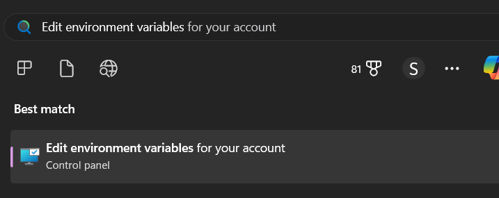
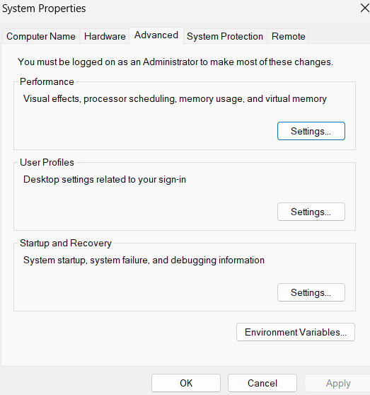
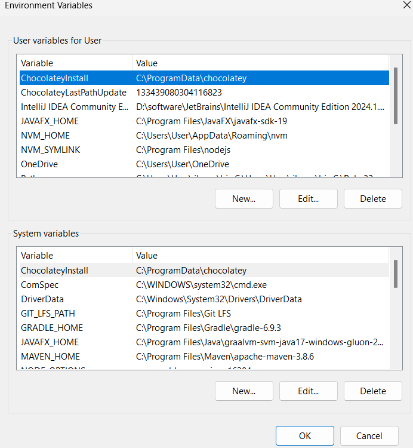
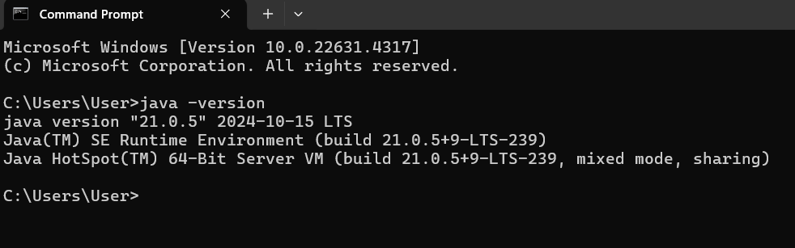

# Install Java in Your System

In this very first post we will learn how to install Java in our system. In order to run Java program, we must need java installed in our system.

Let's go through few scratch steps:

1. We will download openJDK-21 or latest (LTS) version from Oracle official download page. So open  [Download Java](https://www.oracle.com/java/technologies/downloads/?er=221886#java17-windows) and scroll Down little bit.


2. Now from here you can download JDK latest (LTS) version. at the time of writing this article, the latest version was java 21. 

3. If you are windows user, click on windows and you find the predefined archives to download. There are also windows installers. Anyway, we will download the x64 Compressed Archive (.zip) file.

So, click on the .zip file link.


By default the .zip file will be downloaded in Downloads folder in C drive, or you can absolutely change the download destination. The default JDK file name is **jdk-21_windows-x64_bin** (for windows user), and it is also changeable. As usual, we do not do extra anything here. Later, we can if want, change the file name.

**Note:** If you have good internet connection, it takes about less than one minute to download the .zip file. 

4. After downloading the OpenJDK .zip file, click on it and unzip it to any directory or default path.

In our case, for simplicity, create a folder in your C drive and name it java (folder name). And now, we will unzip the openJDK .zip file to the **C:/java** folder. 


Right Click on it. And unzip it to the **C:/java** folder. 

Steps: Right click on it ***> Extract All > Browse > Find out C:/java > Select folder > Click Extract*** 

It will now start to extract the .zip to the **C:/java** folder and the jdk file name will be **jdk-21.0.5**.

5. Now, we will check out, java is already installed in our system or not. 

Open favourite terminal or windows command prompt (CMD) and run the following command:

```
$ java --version
'java' is not recognized as an internal or external command,
operable program or batch file.
```

It means, our system can not recognize java, thus, we have to add the unzip JDK path in the windows system variable.

6. In windows search bar, write **Edit system environment variables** and click on the first appeared link.



If you click on the Edit system environment variables you will see the following window.



Click on Environment variables. Now, the following window will appear.



7. In the System variables, Click New and write the following. 

**Variable Name:** JAVA_HOME (or your preferred one)

**Variable Value:** C:\java\jdk-21.0.5 (You have to copy the path, where the JDK located, in our case C:/java folder)

Now, again in the System variables section, **click on Path > New and write this: %JAVA_HOME%\bin**

Now, continue click on OK, until the system environment window disappears.


8. Now, we again, check out our system recognizes Java or not.

That's why, we repeat step 5. 

Open the windows CMD (command prompt) and, write the following command.

```
$ java -version
java version "21.0.5" 2024-10-15 LTS
Java(TM) SE Runtime Environment (build 21.0.5+9-LTS-239)
Java HotSpot(TM) 64-Bit Server VM (build 21.0.5+9-LTS-239, mixed mode, sharing)
```



It means, Java is successfully installed and recognized by our windows system.

**Note:** In case, you are a Linux or Mac user, check out this tutorial:

[How to Install Java in Your Linux System](https://www.java.com/en/download/help/linux_install.html)

<br/>

[How to Install Java in Your Mac System](https://www.java.com/en/download/help/mac_install.html)

9. Let's Write Some Code Using JShell (optional)

As we have already installed, java in our system, now it's time to write some java code. But, it's not much easy step, at least we need a text editor or IDE in this case. That's why **JSell** comes to the stream. Now, you can just write your java code, from your windows terminal like CMD or windows PowerShell.

Here, JShell was introduced in JDK 9. To start JShell, just you need to enter the ***jshell*** command on the command line.

```
$ jshell
|  Welcome to JShell -- Version 21.0.5
|  For an introduction type: /help intro

jshell>
```

Now, you can simply write you Java code here. Here, I am writing **Hello, World**

```
jshell> "Hello, World"
$1 ==> "Hello, World" //it prints the result immediately
```
In case, numerical value

```
jshell> int num = 10
num ==> 10
```

Here, num is the variable, and 10 is the value stored in it.

***How fun it is! We do not even need to write System.out.println() in order to get the result in the console, even main main method***.


Let's see another example to store summation of two int numbers into result variable.

```
jshell> int num1 = 10
num1 ==> 10

jshell> int num2 = 10
num2 ==> 10

jshell> int result = num1 + num2
result ==> 20
```


