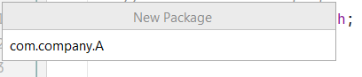

# Java Package

If you already read our java Hello, World tutorial, you may notice we have defined a package name called **com.company** (usually reverse domain name) in order to complete that tutorial. As usual, we can consider the package names, are folder structure of our application. And the root package (usually folder or directory) name should be your companies domain name and that is designed to reverse order. Such as, if the domain name of your company or organization is codeinjar.com, then the directory or package name should be com.codeinjar (Popular TLD domain extensions are: .com, .net, .org, .dev etc.). Then, all the related codes, should be placed into separate directory or package.


Such as, you want to build an e-commerce application and your root package name is com.fruuni; then, the customer management code should reside in com.fruuni.customer; Order management code should reside in com.fruuni.order; Product management code should reside in com.fruuni.product; Authentication management code resides in com.fruuni.auth; etc.

Note: It is not mandatory at all to create folders or directories for handling each tasks, but recommended.

Correction: If your project name is microblog then, the correct order of the package name is: com.fruuni.microblog and all the codes, will reside in the microblog folder. Here, microblog is the artifact name of your project.

However, java also contains it's built in packages like **java.lang**, **java.math**, **java.util** or **java.security** etc. helps to build java Application. Each contains list of classes, interfaces to handle certain tasks. Here, **java.lang** and **java.math** contains fundamental classes those are required to compile java code, implicitly added to the system, thus don't need to import them explicitly. 


**Note:** We basically use ***import*** keyword to add external packages in our java application.

Let's see an example application where we will create a package or directory in our root package com.company. In IntelliJ IDE, put your mouse on **com.company** then, ***right click -> New -> Package***. And now a window will be appeared to name your package. Let's name it A. Now create a class First in com.company.A




Now create a class called **First.java** in ***com.company.A*** package. 

**First.java**

```
package com.company.A;

public class First {

   public void getWeatherInfo(){
        System.out.println("The weather look so shiny today");
    }
    public static void main(String[] args) {
        First obj = new First();
        obj.getWeatherInfo();
    }
}
```

You can see, package **com.company.A** resides at the top level of Java class file, and it must be there.

If you now run **First.java**, you will get the following response.

```
The whether looks so shiny today.
```

## Access Class Members From A Different Package

Now create another package (directory or folder) called B and in that package create a java class called **Second.java** and we try to access the **First.java** class method from this class.

**Second.java**
- resides in package com.company.B

```
package com.company.B;

import com.company.A.First;

public class Second {
    public static void main(String[] args) {
        new First().getWeatherInfo();
    }
}
```

Here, first of all, we have to import the class from the declared package, like **com.company.A.First** or all the class from the desired package, the syntax would be **com.company.A.First.*;** 

If you now run **Second.java** class file that is located in **com.company.B** location then it must return the following result. 

```
The weather look so shiny today
```

One thing to notice here, **how to access class members like methods or properties from a different package**. 

- First of all, import the desired package including class (optionally). 
- Then create object of the class which data members you are going to access.

Such as,

```
import com.company.A.First; //import the package A with class "First"

//then create object of First class to the access it's class members via new First() syntax
//or directly access like the above
```

**Note:** If your methods are default, when you do not use access specifier then, you can not access the method of class **First** from class **Second** as, both are reside in different package.


## Java Built in Packages

Packages are a very important concept in java, as all of our java codes reside in different packages, and even it helps us to organize our programs more concise and maintainable way. Hence, java contains built in packages those are responsible to run our java programs, all are predefined by default. And in order to use them in our programs, we have to import them. Like, **ArrayList** class resides in **java.util** package and to use **ArrayList** class we have to import **ArrayList** class form **java.util** package. So, I am going to write java built in packages below with brief descriptions.


1. **java.lang** - it contains classes and interfaces that are fundamentals and considered the building blocks of the java programs. It is imported by default.

2. **java.util** - it contains classes and interfaces regarding java collection frameworks and utility methods.

3. **java.io** - it contains classes and interfaces that are responsible basically I/O operations(such as file handling).

4. **java.awt** - it offers some building block classes, interfaces or methods to create graphical user interfaces. Nowadays, developers use **[JavaFX](https://openjfx.io/)** to build user interfaces than awt.

5. **java.applet** (deprecated) - it contains functionality to render java into web pages. According to the oracle doc, this package is deprecated in favour of javaScript.

6. **java.beans** - it organizes javaBeans API and helpful for creating own beans by java developers.

7. **java.math** - it provides classes and methods to perform mathematical tasks.

8. **java.net** - contains classes and interfaces to build networking applications, like handling request/response via HTTPS or Sockets.

9. **java.nio/java.io** - it is used to handle input and output operations such file handling in java. Here, java.nio is updated version or java.io.

**Note:** nio package was introduced in Java 1.4 and updated in Java 1.7

10. **java.security** - it contains classes and interfaces that are used to work with security framework or in order to maintain secure communication in java.

11. **java.sql** - contains classes and interfaces to connect java application with relational database.

**Note:** Usually nowadays, developers use progressive framework like JPA or hibernate to handle database operations.

12. **java.text** - it is used to work with text, date, numbers etc.

13. **java.time** - it provides a lot of classes to work with data, time in a natural calendric manner more sophisticated way.

