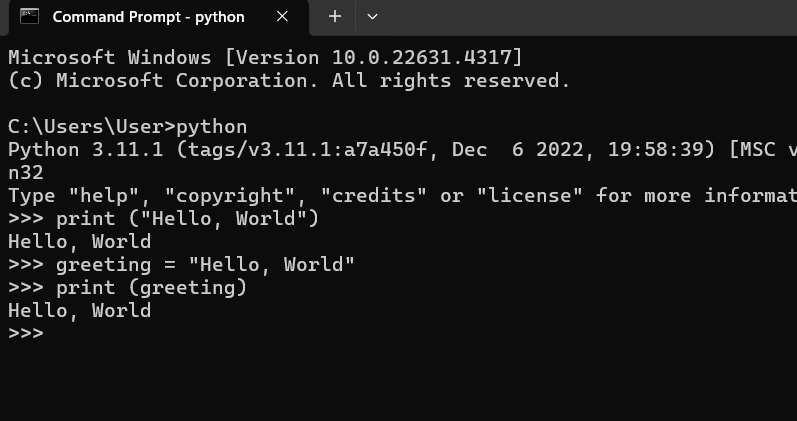

# Python Hello World

Hello, World or write Hello, World using programming language is a vary fascinating job, and it's the first task probably every programmer in this world go through. In this post, we will observer the possible ways to write Hello, Program in python. 

**Note:** Python is't strictly typed language like C++ or Java. Thus all of the things will go smooth without much explanations.

1. First of all, check out python is installed in your operating system or not.

- Open cmd or windows powershell (equivalent macOS cmd)
- Type this command: 
```
$ python --version
Python 3.11.1
```

if it prints something like above, means python is installed otherwise, install python from their official site: [https://www.python.org/downloads/](https://www.python.org/downloads/)

2. Assume, you have already python installed, now we are ready to write our first python Hello, World program.
- Use CMD (CommandLine Tools or Windows Powershell)
- Type the following command
```
python
Python 3.11.1 (tags/v3.11.1:a7a450f, Dec  6 2022, 19:58:39) [MSC v.1934 64 bit (AMD64)] on win32
Type "help", "copyright", "credits" or "license" for more information.
>>>
```
- You can see, it now opens a python shell (one kinda editor - helpful for prototyping)
- >>> Here you can write any python syntax and produce the output. Such as,

```
>>> print ("Hello, World")
'Hello, World' # Hurray, it produces the Hello, World Output
```
- Store Hello, World in a variable (useful for later use or customization)
```
>>> greeting = "Hello, World" # Semicolon is optional and single quotation also works ' '
print (greeting) # access the greeting variable
Hello, World # seems, we are going write direction
```

**Note:** # is used for comment in python, and they are ignored by default, hence don't write them in cmd like shell or editor.

Please look at the image below what's going on above.



2. **Use any text editor to write Hello, World Program**
- Let's open your text editor, it can be Notepad or vs code editor (though I personally use vs code editor for python coding)
- write the following code and save it .py file extension. Such as hello.py
```
# First Hello, World Program
print ("Hello, World"); # Semicolon is optional
```
- I saved this file: hello.py name and it is located in BLOGS\documentation\tutorials\python\hello-world folder in my system (Just remember the path name, if your confused search online or ask me)
- Open the shell again (cmd or powershell)
- and type:
```
py hello.py
Hello, World # We are successfully, output the Hello, World Program
```
- Now, lets modify the hello.py file. Such as, use a variable to store the Hello, World program text message but don't delete the previous code.

```
# First Hello, World Program
print ("Hello, World"); # Semicolon is optional

greeting = "Hello, World";

another_greeting = "Hello, Python";

last_greeting = "I love coding with Python";

# print all the messages
print(greeting) # access the greeting variable
print (another_greeting)
print (last_greeting)
```
- Again run the above command: py hello.py
```
$ py hello.py
Hello, World
Hello, World
Hello, Python
I love coding with Python
```

**Note:** Using python shell script or editor is experimental and probably suitable for common tasks, but please use any python IDE (Integrated Development Environment) like VS code (first choice), PyCharm (for large scale projects) 

