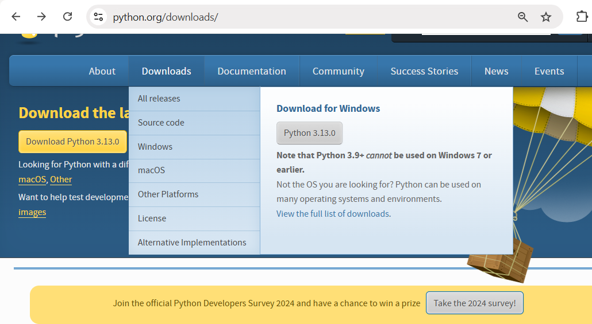
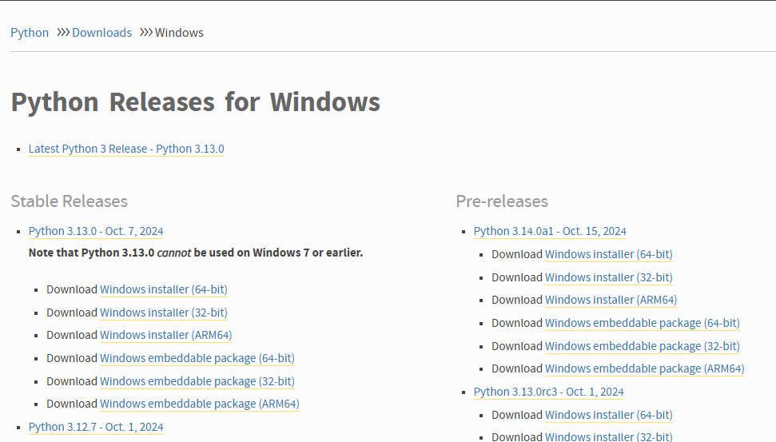
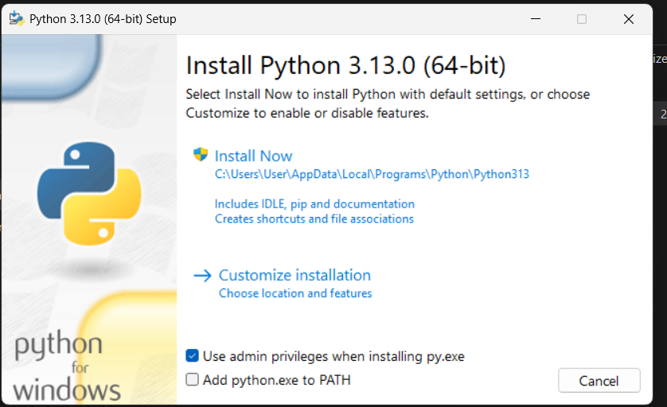
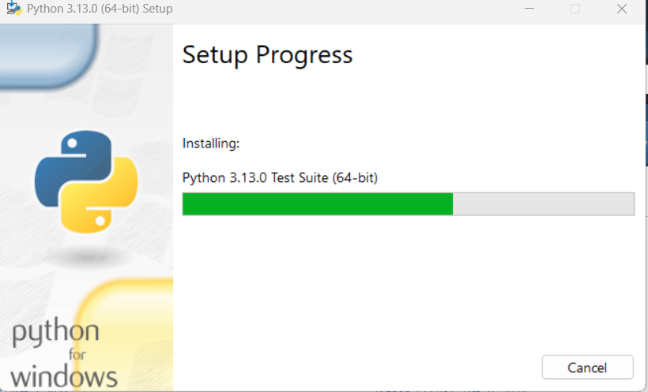
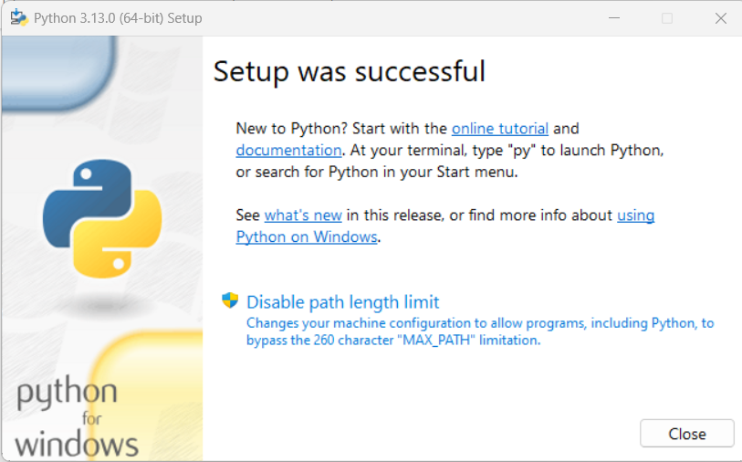

# Install Python in Your System

In order to work with python, it must be installed in your system. But if you are Linux like system like Ubuntu, Debian, Fedora, CentOS, Arch Linux, then probably python is pre-installed there. Also, if you use Windows Chocolatey package manager (like cmd) then probably python is almost installed in your windows system.

**Check Out python is installed or not:**

Windows: (Open cmd or other commandLine Tools and type)

```
$ py --version
Python 3.11.1
```
If python is there then, it print something like the above otherwise it shoes an error message

```
y' is not recognized as an internal or external command,
operable program or batch file.
```

macOS:

```
$ python --version
Python 2.x.x or
python 3.x.x (newest version)
```
**Note:** Your either get Python 2.x.x or Python 3.x.x if python is installed based on your macOS operating system version. As macOS comes with python preinstalled.

**Linux** (Most Linux Distribution has already python installed: 3.x.x)

```
$ python3 --version # or
$ python --version # older linux distribution
```
I checked in Ubuntu  22.04.3 LTS (recent LTS version)

```
$ python3 --version
Python 3.10.12
```

Let's Assume, you use such system, where python is not installed or, you probably need to install python (actually when you use windows like system). So, let's install python in your operating system if python is not there.

1. Visit python official download page.
[https://www.python.org/downloads/](https://www.python.org/downloads/)

This page will appear:



2. Click on windows download (click macOS or linux in case if you ar on those system)

 

Now, you come to the above page. Click on any of the stable release version based on operating system. Note, most of the windows operating system 64 bit. 

**click on Windows installer (64-bit)** (or click on alternatives, in case your are on those)

3. Wait few seconds (probably minutes) till the download is complete. After completing the download (it's a python installer package) click on it. Look at the following illustrations



You either click on ***install now option*** or ***customize installation*** (for advanced user). Please click on ***install now button***.



It takes few seconds to complete the download process.

After complete the download, you will see the following interface.



4. Click Close button.

Now, python is successfully installed in your system.

5. Open cmd or other CommandLine Tools in order to check python is truly installed or not.

```
$ python --version
Python 3.11.1
```

It means, python is installed successfully in our operating system. In case you got any error message, please reverse the installation process.

**Note:** If you chose customize installation process (though it's suitable for advanced users), you have to manually set up the path variables to run successfully the above command.

Thanks.